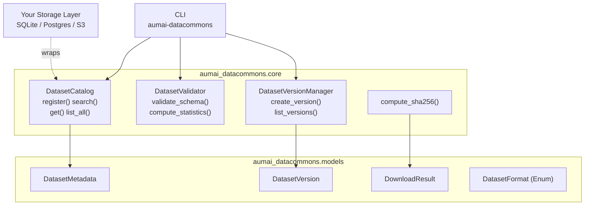

# aumai-datacommons

> Open datasets for agent development — curate, version, and distribute training and evaluation data with full provenance tracking.

[](https://github.com/aumai/aumai-datacommons/actions)
[](https://pypi.org/project/aumai-datacommons/)
[](LICENSE)
[](https://python.org)

Part of the [AumAI](https://github.com/aumai) open-source ecosystem for agentic AI infrastructure.

---

## What is this?

Think of `aumai-datacommons` as a **library card catalog for AI datasets** — but one that also knows how to validate your books, track their edition history, and fingerprint every page for integrity.

When you build AI agents, you need data: training corpora, evaluation benchmarks, few-shot example banks, retrieval indexes. That data has a lifecycle. It gets created, versioned, shared with teammates, and eventually superseded. Without a principled way to track that lifecycle, you end up with the classic AI team nightmare: `data_final_v3_REAL_FINAL.jsonl` living in a shared drive, with no idea what changed between versions or whether the file you downloaded yesterday is still the same file today.

`aumai-datacommons` solves this by giving every dataset a **stable identity** (`dataset_id`), a **rich metadata record** (`DatasetMetadata`), a **version history** (`DatasetVersionManager`), and a **content fingerprint** (`compute_sha256`). A `DatasetCatalog` acts as the in-memory registry, and a `DatasetValidator` lets you assert that your JSONL or CSV files actually conform to an expected schema before you feed them to a model.

The library is deliberately I/O-agnostic: `DatasetCatalog` is a pure in-memory structure with no file handles, so you can wrap it with SQLite, Postgres, S3, or any storage layer you already have.

---

## Why does this matter?

### The provenance gap in AI development

Most software engineering disciplines have strong tooling for source code provenance (git) but almost nothing for *data* provenance. Yet data is the direct determinant of model behavior. A dataset without a version is like a codebase without commits: you cannot reproduce experiments, audit decisions, or roll back a regression.

### Evaluation data is first-class infrastructure

A benchmark that silently gains 200 rows between two runs invalidates every comparison you drew. `DatasetVersionManager` makes version bumps explicit and auditable, so your leaderboard numbers mean something.

### Schema drift kills pipelines

JSONL files are flexible by design, which means fields disappear without warning. `DatasetValidator.validate_schema` catches this at ingest time, before a missing field causes a silent `KeyError` three pipeline stages later.

---

## Architecture



---

## Features

- **Dataset registration** — attach rich metadata (name, description, format, size, record count, schema, license, tags, version) to any dataset
- **Full-text search** — case-insensitive substring search across name and description, with optional format and tag filters
- **Schema validation** — line-by-line JSONL validation against a field-type map; catches missing fields and type mismatches with precise line numbers
- **Statistics computation** — row counts, per-field null counts, and type distribution for both JSONL and CSV files
- **Semantic versioning** — auto-incremented minor version bumps with human-readable change descriptions
- **SHA-256 integrity** — streaming 64 KB chunk file hashing with no memory overhead
- **Paginated listing** — `limit`/`offset` pagination over the full catalog
- **Pydantic models throughout** — all data structures validated at construction time
- **I/O-agnostic core** — `DatasetCatalog` holds no file handles; wrap it with any persistence layer
- **Click CLI** — `search`, `register`, `validate`, `stats`, `list`, `get` commands

---

## Quick Start

### Installation

```bash
pip install aumai-datacommons
```

### Register your first dataset

Create a metadata file `my-dataset.json`:

```json
{
  "dataset_id": "agent-traces-001",
  "name": "Agent Execution Traces",
  "description": "ReAct-style agent traces for tool-use fine-tuning.",
  "format": "jsonl",
  "size_bytes": 1048576,
  "num_records": 5000,
  "schema": {
    "prompt": "str",
    "thoughts": "list",
    "tool_calls": "list",
    "final_answer": "str"
  },
  "license": "CC-BY-4.0",
  "tags": ["agents", "tool-use", "react", "fine-tuning"],
  "version": "1.0.0"
}
```

```bash
aumai-datacommons register --config my-dataset.json
# Dataset 'agent-traces-001' registered successfully (v1.0.0).
```

### Search the catalog

```bash
aumai-datacommons search --query "agent traces"
aumai-datacommons search --query "fine-tuning" --format jsonl --tag agents --tag tool-use
```

### Validate a dataset file

Create a schema file `schema.json`:

```json
{
  "prompt": "str",
  "thoughts": "list",
  "tool_calls": "list",
  "final_answer": "str"
}
```

```bash
aumai-datacommons validate --dataset traces.jsonl --schema schema.json
# Validation passed — no errors found.
```

### Inspect statistics

```bash
aumai-datacommons stats --dataset traces.jsonl
```

Output:

```json
{
  "row_count": 5000,
  "null_counts": { "thoughts": 12 },
  "type_distribution": {
    "prompt": { "str": 5000 },
    "final_answer": { "str": 4988, "NoneType": 12 }
  }
}
```

---

## CLI Reference

### `aumai-datacommons search`

Search the catalog for datasets matching a query string.

```
Options:
  --query TEXT                              Search query string.  [required]
  --format [jsonl|csv|parquet|arrow]        Filter by dataset format.
  --tag TEXT                                Filter by tag (repeatable).
```

**Examples:**

```bash
# Basic text search
aumai-datacommons search --query "evaluation benchmark"

# Filter by format and multiple tags
aumai-datacommons search --query "NLP" --format jsonl --tag en --tag sentiment
```

---

### `aumai-datacommons register`

Register a dataset from a JSON metadata file whose keys match the `DatasetMetadata` schema.

```
Options:
  --config PATH   Path to a JSON config file.  [required]
```

**Example:**

```bash
aumai-datacommons register --config ./datasets/my-dataset.json
```

---

### `aumai-datacommons validate`

Validate a JSONL file against a field-type schema. Exits with code 1 on any validation failure.

```
Options:
  --dataset PATH   Path to a JSONL dataset file.  [required]
  --schema PATH    Path to a JSON schema file (field-name to type-name map).  [required]
```

Valid type names: `str`, `int`, `float`, `bool`, `list`, `dict`.

**Example:**

```bash
aumai-datacommons validate --dataset data.jsonl --schema schema.json
```

---

### `aumai-datacommons stats`

Print row count, null counts, and type distribution for a JSONL or CSV file.

```
Options:
  --dataset PATH   Path to a JSONL or CSV dataset file.  [required]
```

**Example:**

```bash
aumai-datacommons stats --dataset data.csv
```

---

### `aumai-datacommons list`

List all registered datasets with pagination.

```
Options:
  --limit INTEGER    Max results to show.  [default: 20]
  --offset INTEGER   Skip first N results.  [default: 0]
```

**Example:**

```bash
aumai-datacommons list --limit 10 --offset 20
```

---

### `aumai-datacommons get DATASET_ID`

Show full JSON metadata for a dataset by ID. Exits with code 1 if the dataset is not found.

**Example:**

```bash
aumai-datacommons get agent-traces-001
```

---

## Python API

### Register and search

```python
from aumai_datacommons import DatasetCatalog, DatasetMetadata, DatasetFormat

catalog = DatasetCatalog()

metadata = DatasetMetadata(
    dataset_id="eval-bench-002",
    name="Tool-Use Evaluation Benchmark",
    description="Curated evaluation set for tool-calling agents.",
    format=DatasetFormat.jsonl,
    size_bytes=204800,
    num_records=800,
    license="Apache-2.0",
    tags=["evaluation", "tool-use", "benchmark"],
)
catalog.register(metadata)

results = catalog.search("evaluation", tags=["benchmark"])
for item in results:
    print(item.dataset_id, item.name)
```

### Version a dataset

```python
from aumai_datacommons import DatasetVersionManager

manager = DatasetVersionManager()

v1 = manager.create_version("eval-bench-002", "Initial release with 800 examples.")
print(v1.version)  # "1.0.0"

v2 = manager.create_version("eval-bench-002", "Added 200 multi-hop tool-call examples.")
print(v2.version)  # "1.1.0"

for entry in manager.list_versions("eval-bench-002"):
    print(entry.version, entry.changes)
```

### Validate and compute statistics

```python
from aumai_datacommons import DatasetValidator

validator = DatasetValidator()

errors = validator.validate_schema("eval.jsonl", {
    "prompt": "str",
    "expected_tool": "str",
    "expected_args": "dict",
})
if errors:
    for error in errors:
        print(error)
else:
    print("All records valid.")

stats = validator.compute_statistics("eval.jsonl")
print("Rows:", stats["row_count"])
print("Nulls:", stats["null_counts"])
```

### Compute file integrity hash

```python
from aumai_datacommons import compute_sha256

digest = compute_sha256("eval.jsonl")
print(digest)  # lowercase hex SHA-256
```

---

## Configuration

`DatasetCatalog` is a pure in-memory store. Persist it by serializing to JSON:

```python
import json
from aumai_datacommons import DatasetCatalog, DatasetMetadata

def save_catalog(catalog: DatasetCatalog, path: str) -> None:
    data = [m.model_dump(mode="json") for m in catalog.list_all(limit=100_000)]
    with open(path, "w") as file_handle:
        json.dump(data, file_handle, indent=2)

def load_catalog(path: str) -> DatasetCatalog:
    catalog = DatasetCatalog()
    with open(path) as file_handle:
        records = json.load(file_handle)
    for record in records:
        catalog.register(DatasetMetadata.model_validate(record))
    return catalog
```

---

## How It Works

### DatasetCatalog

`DatasetCatalog` wraps a plain Python `dict[str, DatasetMetadata]` keyed by `dataset_id`. Registration is an O(1) dict assignment. Search is an O(n) linear scan — acceptable for catalogs up to tens of thousands of entries. The `search()` method performs: (1) case-insensitive substring check on `name` and `description`, (2) exact enum match on `format` if specified, (3) set membership check ensuring every requested tag appears in the dataset's tag set.

### DatasetValidator

`validate_schema()` reads a JSONL file line by line, parses each line as JSON, and checks every required field against the declared type using `isinstance`. This is streaming — it never loads the entire file into memory. Supported type names map to Python primitives: `str`, `int`, `float`, `bool`, `list`, `dict`.

`compute_statistics()` performs a single pass to accumulate null counts (treating `None` and empty string as null) and type frequency distributions per field. Handles both JSONL (default) and CSV (detected by `.csv` extension using `csv.DictReader`).

### DatasetVersionManager

Versions follow semantic versioning. Each call to `create_version()` auto-increments the minor component of the last recorded version, producing a monotonically increasing sequence (`1.0.0` -> `1.1.0` -> `1.2.0`). If no previous version exists for a dataset, it starts at `1.0.0`.

### compute_sha256

Reads the file in 64 KB chunks using `iter()` with a sentinel, keeping memory usage flat regardless of file size. Returns the lowercase hex digest.

---

## Integration with Other AumAI Projects

| Project | Integration |
|---|---|
| `aumai-specs` | Define `DatasetMetadata` schemas using aumai-specs contract definitions |
| `aumai-agentmarket` | Reference `dataset_id` values in agent listings to declare training data provenance |
| `aumai-sovereignstack` | Attach data residency metadata to datasets for jurisdictionally-constrained deployments |

---

## Documentation

- [Getting Started](docs/getting-started.md)
- [API Reference](docs/api-reference.md)
- [Examples](examples/)
- [Contributing](CONTRIBUTING.md)

---

## Contributing

See [CONTRIBUTING.md](CONTRIBUTING.md). All contributions require type hints on every function signature, tests alongside implementation (pytest + hypothesis), `ruff` and `mypy --strict` passing, and conventional commit messages (`feat:`, `fix:`, `refactor:`, `docs:`, `test:`, `chore:`).

---

## License

Apache 2.0 — see [LICENSE](LICENSE) for details.

---

## Part of AumAI

This project is part of [AumAI](https://github.com/aumai) — open source infrastructure for the agentic AI era.
